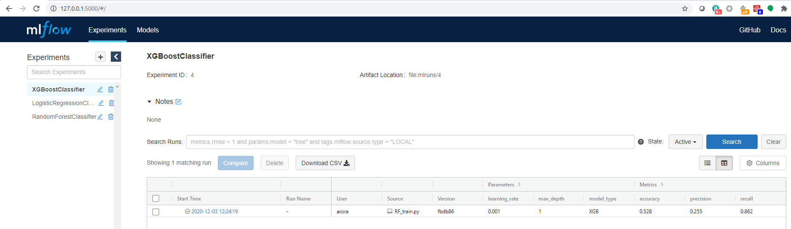
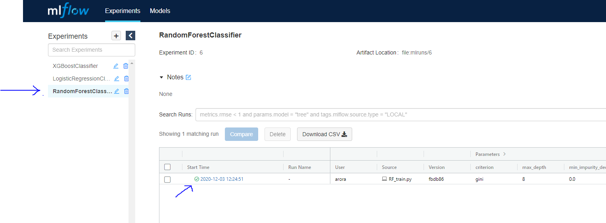
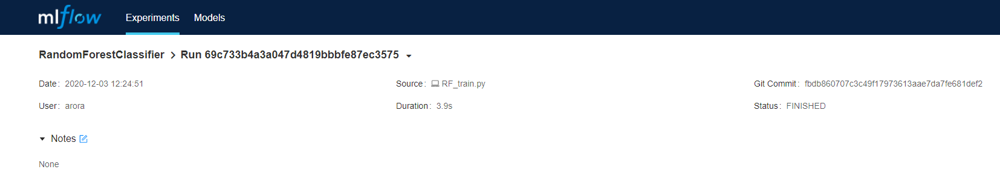
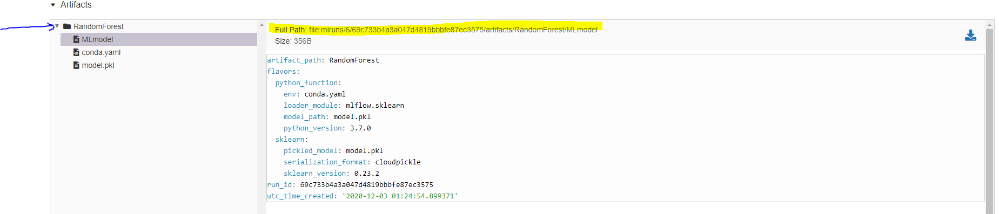

# Name Entity Recognition (NER) for domain specific text using Pytorch & MLFlow

The repo contains code for experimenting, training and serving a name entity recognition a.k.a token classification model using Pytorch Framework in Python.

The repository offers a script to automatically train model directly from github or via command line and finally serve the same model using MLFlow in-build pytorch support.

## Prerequisites
1) Python knowledge
2) Tesseract installed and tesseract instllation path in your machine's PATH enviornment variable (if data is not available in text format)
3) Admin access to machine (if you need to create conda environment)


## Steps to run this on a local machine (tested on Ubuntu 18.04)
Steps to run this on you local machine are as follows:

### Setup

#### Setup repository
1) Clone this repo to the local machine
2) cd into the cloned directory
3) Copy the data pickle file named as "dataset_ready_list.pkl" in to the data folder
   
#### Setup conda environment

###### Download & Install Anaconda
Skip below commands if you already have anaconda installed in your machine
1) Run command ```bash script.sh setmeup```
2) If above command gave any error, please run step 3 & 4 and also the next step i.e. 'Create & activate anaconda environment' else skip them
3) Install conda from official [Anaconda](https://docs.anaconda.com/anaconda/install/) website
4) Run command ```source ~/.bashrc``` followed by ```conda init```

###### Create project environment
1) Run command ```conda env create -f environment.yml```
2) Run command ```conda activate domain-ner```


### Prepare Data

The model expects data to a nested list os nested tuples as mentioned under [Data-Format](#data-format) section.

#### Data Format
Data should be a pickled list of nested tuples where each parent tuple represents a document and each child tuple of a parent represents word (separated by space) and its respective token classification. Example below - 
```
Assuming there are two documents as below - 
1. Canberra is the capital of Commonwealth of Australia and Scott Morrison is its Prime Minister
2. ABC Ltd is one of the largest IT company in Australia

[(  ('canberra', 'LOC-B'),
    ('is', 'O'),
    ('the', 'O'),
    ('capital', 'O'),
    ('of', 'O'),
    ('commonwealth', 'LOC-B'),
    ('of', 'LOC-I'),
    ('australia', 'LOC-I'),
    ('scott', 'PER-B'),
    ('morrison', 'PER-I'),
    ('is', 'O'),
    ('its', 'O'),
    ('Prime', 'O'),
    ('Minister', 'O')
),
(   ('ABC', 'ORG-B'),
    ('Ltd', 'ORG-I'),
    ('is', 'O'),
    ('one', 'O'),
    ('of', 'O'),
    ('the', 'O'),
    ('largest', 'O'),
    ('IT', 'O'),
    ('company', 'O'),
    ('in', 'O'),
    ('Australia', 'LOC-B')
),]
```

###### OCR
If the original source of data are images, then it would first need to be OCR'd. Below command can be run to OCR all images in a directory by supplying diretory path and text save location as arguments to code. A full list of acceptable arguments is also provided below.
```commandline
python ocr_images.py --data-dir <path to image directory> --save-dir-path <directory to save text> --filename <filename to be saved with>
``` 

All acceptable parameters are - 
```commandline
--help                  Show this help message and exit
--data-dir              Directory path containing json annotation files
--allowed-image-ext     Allowed image file extensions separted by commas. Default - .jpg, .jpeg, .png
--save-dir-path         Directory path to save dataset pickle file
--filename              Name of pickle file to save
--pickle-protocol       Pickle Protocol
```

###### Annotate data
Data annotation can be done through either label studio tool or doccano. 


###### Prepare data in reqired format
Below command can be run to build data in a format that is expected by training code
```commandline
python prepare_data_from_label_studio_annotations.py --data-path <path to annotated data file> --file-ext <file extension of labelling files. Example .json> --save-dir-path <directory to save text> --filename <filename to be saved with> --pickle-protocol <defaults to 3>
``` 

```commandline
  --help            Show this help message and exit
  --data-path       Directory path containing json annotation files, defaults to data
  --file-ext        File extension to look for in data path, defaults to json
  --save-dir-path   Directory path to save dataset pickle file, defaults to data
  --filename        Name of pickle file to save, defaults to data_ready_list.pkl
  --pickle-protocol Pickle Protocol, defaults to 3
```

### Training models and running experiments

##### Train model
Python file [train_cnn_rnn_crf.py](train_cnn_rnn_crf.py) requires to be run in order to train a model. All model parameters have a default value which can be changed in order to experiment. These parameters can be passed to model in follwing ways:

###### Command line arguments
Run below command with parameters shown in [Parameter](#parameters) with parameters of your choice
```
python train_cnn_rnn_crf.py --param param_value
```
Below is an example that trains model for 35 epochs on a custom dataset with a batch size of 8 and test set of 30%

```
python train_cnn_rnn_crf.py --data-path "path to data file" --batch-size 8 --epochs 35 --split-size .3
```
 
###### Config file
The repository contains [config.yml](config.yml) file which contains default values for all the these parameters defined below in [Parameter](#parameters) section. A user can change the parameter/hyperparameter values in this file and run ```python train_cnn_rnn_crf.py``` to train the mdel with updated values

###### Through mlflow
Use can simply update the [config.yml](config.yml) to experiment with different parameters and run command ```mlflow run . --no-conda``` if you already have a conda environment setup and ```mlflow run .``` if user would like to setup a conda environment from scratch 

###### Directly from github (Not recommended)
Ideally, the data should never be put on github and hence in order to run directly from github, the data_path variable in config.yml should be set to the correct data location before running below process. Same way any other parameters that user might want to change can be changed directly on github config.yml before following below process.

1) Ensure you have got conda installed in the machine. If not, install from official [Anaconda](https://docs.anaconda.com/anaconda/install/) site
2) Ensure you have mlflow installed in your active conda environment. If not, run command ```conda install -c conda-forge mlflow```
3) Ensure you have access to internet
4) Run command ```mlflow run <git-repo-path>```

## Parameters
There are many parameters that we can experiment our models with. Below is a detailed list of parameters, their default values and allowed values.

```
  --data-path (str)  --> Data file path - pickle format (Defaults to data/data_ready_list.pkl)
  --comment (str) --> Any comment about training step (Defaults to run time)
  --exp-name (str) --> MLFLOW Experiment Name (Defaults to 'LIQ Unstructured Forms')
  --epochs (int) --> Number of epochs to run (Defaults to 32)
  --dropout (float) --> Dropout to apply (<1) (Defaults to .5)
  --rnn-stack-size (int) --> Number of LSTM layers to stack (Defaults to 1)
  --max-sen-len (int) --> Max Senetence Length (Defaults to 700)
  --max-word-len (int) --> Max Word Length (Defaults to 0 which means auto calculate during training)
  --lr (float) --> Learning Rate (Defaults to 0.001)
  --split-size (float) --> Test Split Size Learning Rate (Defaults to 0.2)
  --gpu (bool) --> Whether to use GPU or not (Defaults to True)
  --batch-size (int) --> Batch Size (Defaults to 6)
  --word-embed-cache-path (str) --> Glove word embedding cache dir path. 
                                    Pass '' or None to train embeddings 
                                    from scratch (Defaults to
                                    .word_vectors_cache directory in home dir) 
  --word-embed-name (str) --> Glove word embedding name (Defaults to 840B, other options - 6B, 27B, 42B)
  --word-embed-freeze (bool) --> Freeze word embedding weights (Defaults to True)
  --word-embed-dim (int) --> Word embedding dimension. Ignore if providing a pre-trained word
                             embedding (Defaults to 512)
  --char-cnn-out-dim (int) --> Character CNN out dimentions (Defaults to 32)
  --rnn-type (str) --> RNN Type - LSTM or GRU (Defaults to LSTM)
  --rnn-hidden-size (int) --> LSTM hidden size (Defaults to 512)
```
Above parameters can also be seen by running command ```python train_cnn_rnn_crf.py --help``` 

### View and compare models

##### Spin up GUI
Run any one of the step 1 or 2 and then step 3

1) Run command ```mlflow ui --host 0.0.0.0 --port 5000```

                                              OR

2) Run command ```mlflow server --host 0.0.0.0 --port 5000```
3) Start a browser and open link 127.0.0.1:5000

##### Compare
1) At this point user should be able to see all experiments that exist in the repo already and also any new experiments that you will run in your local machine in the MLflow GUI


2) Users can compare models based in evaluation metrices results and decide which model(s) they want to deploy

### Serving model(s)
1) To be able to serve model(s), user needs to know the artifact & model path of it. To view this, open a model in the MLFlow GUI as shown in screenshot below



2) Once you have the model opened, it should look something like below screenshot



3) To get the address of artifact and model, scroll down to the section called Artifacts
4) Expand the Experiment Name link on left (see screenshow below)
5) Copy the model path as highlighed in yellow in the below screenshot



6) There are chances that it might not show the full path of the artifact so user may have to prepend the current working directory so it becomes full path and also remove the file name at the end as we only need to input the directory path
7) Run command ```mlflow models serve -m "<full-path-to-artifact-directory-copied-in-above-step>" -h 0.0.0.0 -p 2125 --no-conda``` to serve the model

*Please note that it is not neccessary to use port 2125 but use could choose to use a different port too*

8) If user wishes to deploy more than one model, the same command as in step no. 6 can be used with new model artifact and a different port number


### Inference
1) Once a model is deployed, it is already being served at a REST endpoint . In this instance at, https://127.0.0.1:2125
2) To get predictions, one needs to send POST request on the endpoint (TBU)
3) Code for inference is available in [infer.py](./infer.py)
